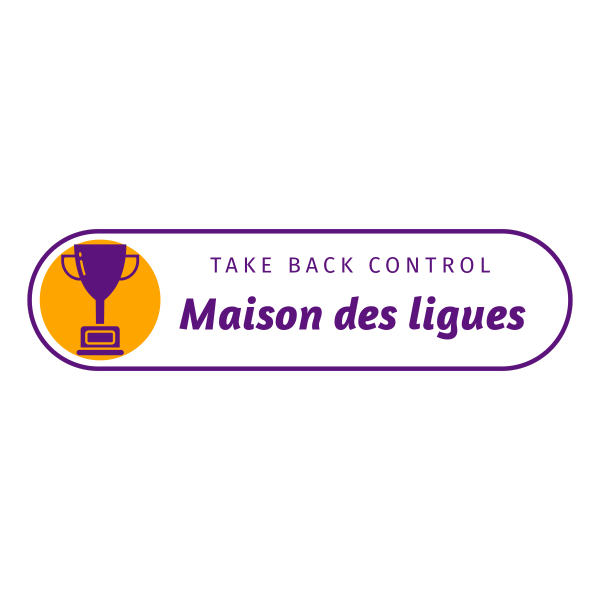

  <h1 style="margin: 0;">Projet Maison des Ligues</h1>
  

---

## 🌟 À propos du projet

Ce projet consiste à développer une plateforme intranet pour une entreprise en pleine expansion. L'objectif est de faciliter les relations entre les collaborateurs en offrant des fonctionnalités pratiques et intuitives.

## 🛠️ Technologies utilisées

- **Front-end** : HTML, CSS, JavaScript
- **Back-end** : PHP

## ✨ Fonctionnalités

- **Connexion des utilisateurs** : Authentification sécurisée pour tous les collaborateurs.
- **Affichage aléatoire d'un collaborateur** : Découvrez un collègue au hasard chaque jour !
- **Liste des collaborateurs avec filtres** : Trouvez facilement vos collègues grâce à des filtres pratiques.
- **Modification des informations personnelles** : Mettez à jour vos informations en toute simplicité.
- **Gestion des administrateurs** : Ajoutez, modifiez ou supprimez des collaborateurs en quelques clics.

---

Merci de votre intérêt pour le projet Maison des Ligues ! 😊
